# Analyse Dynamique d'une Application Android Vulnérable avec MobSF & DIVA

---

## Table des matières

1. [Contexte & Objectifs](#1-contexte--objectifs)
2. [Environnement technique](#2-environnement-technique)
3. [Mise en place de l'infrastructure d'analyse](#3-mise-en-place-de-linfrastructure-danalyse)
   - [3.1 Création de l'émulateur AVD](#31-création-de-lémulateur-avd-sans-play-store)
   - [3.2 Clonage de MobSF](#32-clonage-du-dépôt-mobsf)
   - [3.3 Lancement de l'émulateur via le script MobSF](#33-lancement-de-lémulateur-via-le-script-mobsf)
   - [3.4 Déploiement de MobSF via Docker](#34-déploiement-de-mobsf-via-docker)
4. [Analyse de l'application cible — DIVA](#4-analyse-de-lapplication-cible--diva)
   - [4.1 Upload & Analyse statique](#41-upload--analyse-statique)
   - [4.2 Lancement de l'analyse dynamique](#42-lancement-de-lanalyse-dynamique)
5. [Tests de sécurité dynamiques](#5-tests-de-sécurité-dynamiques)
   - [5.1 Insecure Logging](#51-insecure-logging--cwe-532)
   - [5.2 TLS/SSL Security Testing](#52-tlsssl-security-testing--cwe-295)
   - [5.3 Exported Activities — Access Control](#53-exported-activities--access-control-cwe-926)
   - [5.4 Hardcoded Credentials](#54-hardcoded-credentials--cwe-798)
   - [5.5 Input Validation Issues](#55-input-validation-issues--cwe-20)
   - [5.6 Runtime Dependencies](#56-runtime-dependencies)
   - [5.7 Instrumentation Frida](#57-instrumentation-frida)
6. [Synthèse des vulnérabilités](#6-synthèse-des-vulnérabilités)
7. [Rapport MobSF](#7-rapport-mobsf)
8. [Conclusion](#8-conclusion)

---

## 1. Contexte & Objectifs

Ce lab porte sur l'**analyse dynamique (runtime)** d'une application Android à l'aide de **MobSF (Mobile Security Framework)**, un framework open-source d'analyse de sécurité mobile automatisé. Contrairement à l'analyse statique qui inspecte le code source décompilé sans l'exécuter, l'analyse dynamique observe le comportement réel de l'application lors de son exécution : flux réseau, accès fichiers, logs, invocations de méthodes, etc.

L'application cible est **DIVA (Damn Insecure and Vulnerable Android App)**, une application Android intentionnellement conçue pour exposer les vulnérabilités les plus fréquentes rencontrées en pentest mobile, telles que définies dans le référentiel **OWASP Mobile Top 10**.

**Objectifs du lab :**

- Configurer un environnement d'analyse dynamique Android isolé et rooté
- Instrumenter une application à l'aide de **Frida** pour hooker des méthodes à l'exécution
- Intercepter le trafic réseau TLS/HTTPS via un proxy MITM
- Identifier et exploiter des vulnérabilités runtime : insecure logging, hardcoded secrets, exported activities, absence de certificate pinning, input validation issues
- Générer un rapport d'analyse complet

---

## 2. Environnement technique

| Composant | Détail |
|---|---|
| OS hôte | Windows 10 / 11 (x86_64) |
| Émulateur | Android Virtual Device (AVD) — API 30, x86_64, Google APIs |
| Android Version | Android 11 (API Level 30) |
| MobSF | `opensecurity/mobile-security-framework-mobsf:latest` (Docker) |
| Application cible | DIVA — `jakhar.aseem.diva` — v1.0 |
| Package SHA256 | `5cefc51fce9bd760b92ab2340477f4dda84b4ae0c5d04a8c9493e4fe34fab7c5` |
| Frida | Injecté automatiquement par MobSF |
| ADB Identifier | `emulator-5554` |

---

## 3. Mise en place de l'infrastructure d'analyse

### 3.1 Création de l'émulateur AVD sans Play Store

L'analyse dynamique avec MobSF impose des contraintes strictes sur l'image Android utilisée. J'ai créé un **Android Virtual Device (AVD)** via Android Studio en sélectionnant une image **Google APIs sans Google Play**.

**Justification technique :**

- Les images Google Play embarquent des processus système supplémentaires (Google Play Services, GMS Core, Firebase) qui génèrent du trafic réseau parasite, rendant l'analyse du trafic applicatif difficile à isoler.
- Le montage `/system` en écriture est nécessaire pour que MobSF installe son **certificat CA root** et configure le proxy HTTPS global. Ce montage n'est accessible qu'avec des images sans Play Store (les images Google Play verrouillent `/system` en lecture seule depuis Android 9+).
- L'accès root est requis pour l'injection de **Frida Server** dans les processus applicatifs.
- MobSF supporte l'analyse dynamique jusqu'à **API Level 30** maximum — au-delà, `/system` n'est plus modifiable même sur des images sans Play Store.

**Configuration retenue :**
- Device : Pixel 5
- System Image : Android 11.0 (Google APIs) — x86_64 — **sans Google Play**
- AVD Name : `MobSF_DIVA_API_30`

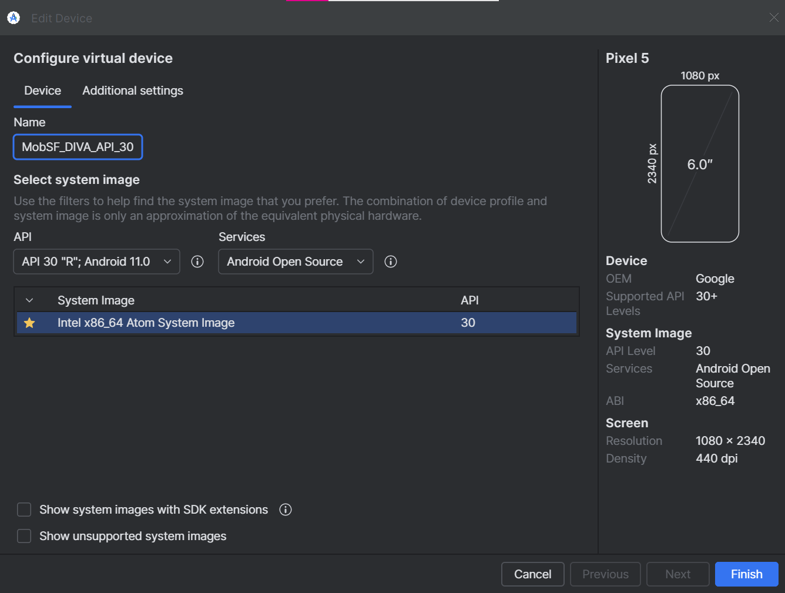

---

### 3.2 Clonage du dépôt MobSF

J'ai cloné le dépôt officiel MobSF afin d'accéder aux scripts de démarrage de l'émulateur. Ces scripts (`start_avd.sh` / `start_avd.ps1`) effectuent automatiquement les opérations de configuration root et proxy que ne réalise pas un lancement classique depuis l'AVD Manager.

```bash
git clone https://github.com/MobSF/Mobile-Security-Framework-MobSF.git
cd Mobile-Security-Framework-MobSF
```

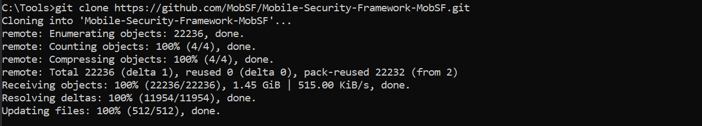

---

### 3.3 Lancement de l'émulateur via le script MobSF

Le script MobSF démarre l'émulateur avec les flags nécessaires à l'analyse dynamique, notamment `-writable-system` qui monte la partition système en écriture et `-no-snapshot` qui garantit un état propre à chaque démarrage.


# Windows (PowerShell)
.\scripts\start_avd.ps1 MobSF_DIVA_API_30
```

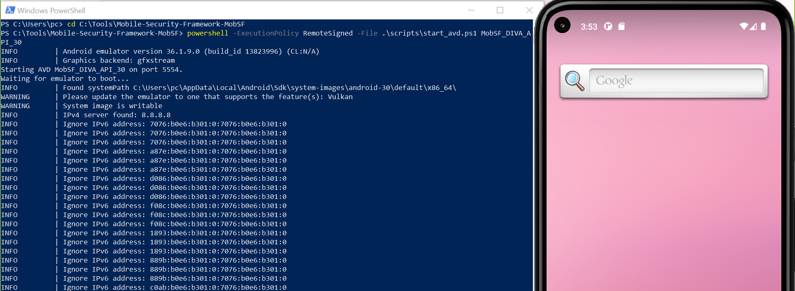

**Vérification de la détection ADB :**

```bash
adb devices
```

```
List of devices attached
emulator-5554   device
```

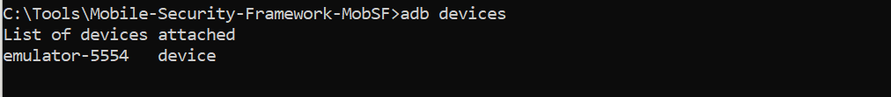

L'identifiant `emulator-5554` est retourné par ADB. Il sera passé comme variable d'environnement `MOBSF_ANALYZER_IDENTIFIER` au conteneur Docker MobSF pour lui indiquer sur quel device effectuer l'analyse.

---

### 3.4 Déploiement de MobSF via Docker

MobSF est déployé sous forme de conteneur Docker. J'ai d'abord récupéré l'image officielle :

```bash
docker pull opensecurity/mobile-security-framework-mobsf:latest
```

Puis lancé le conteneur avec la variable `MOBSF_ANALYZER_IDENTIFIER` positionnée sur l'identifiant ADB de l'émulateur :

```bash
docker run -it --rm \
  -p 8000:8000 \
  -e MOBSF_ANALYZER_IDENTIFIER=emulator-5554 \
  opensecurity/mobile-security-framework-mobsf:latest
```

> **Note :** L'émulateur doit impérativement être démarré **avant** le conteneur MobSF. Au démarrage, MobSF tente de se connecter à l'émulateur via ADB pour configurer le proxy système et installer le certificat CA — si l'émulateur n'est pas disponible, l'analyse dynamique échoue avec `Dynamic Analysis Failed`.

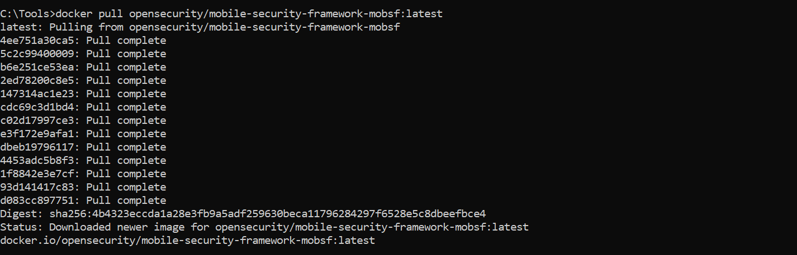

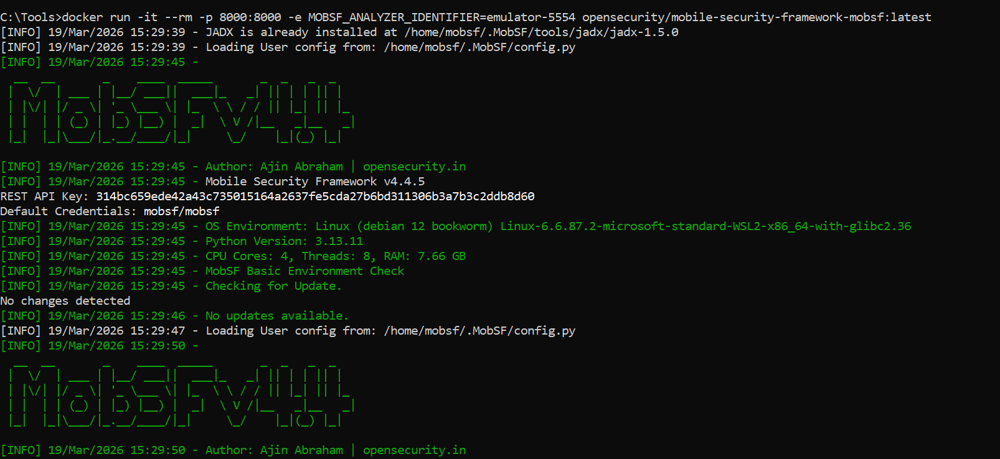

L'interface web est accessible à `http://127.0.0.1:8000`. Identifiants par défaut : `mobsf / mobsf`.

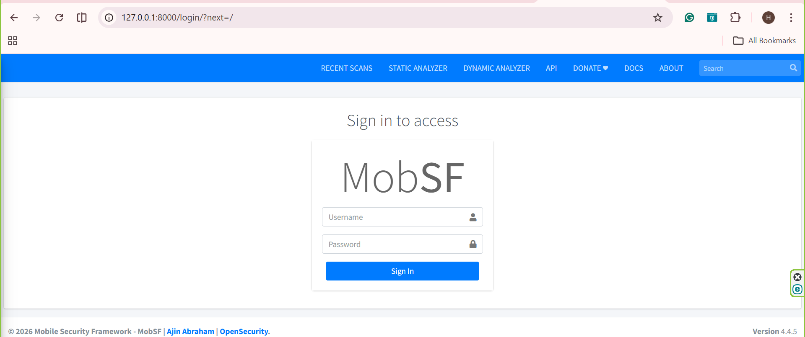

---

## 4. Analyse de l'application cible — DIVA

### 4.1 Upload & Analyse statique

J'ai téléchargé l'APK DIVA depuis le dépôt officiel (`https://github.com/payatu/diva-android`) et effectué l'upload via **Upload & Analyze** dans MobSF.

MobSF procède d'abord à une **analyse statique automatique** : décompilation via `apktool` et `jadx`, extraction du `AndroidManifest.xml`, analyse des permissions déclarées, détection de patterns de code dangereux (secrets en dur, API sensibles), calcul d'un score de sécurité.

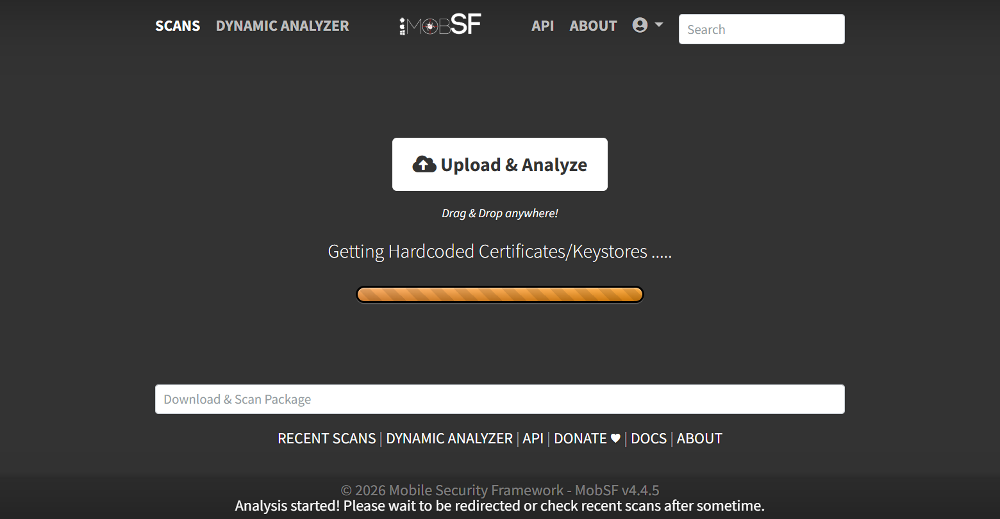

**Résultats de l'analyse statique :**

- **Security Score : 36/100** — révélateur d'un niveau de vulnérabilités élevé
- **2/17 Exported Activities** — deux activités accessibles sans permission déclarée
- **0/0 Exported Services**
- **0/0 Exported Receivers**
- **1/1 Exported Providers** — un content provider exposé sans protection

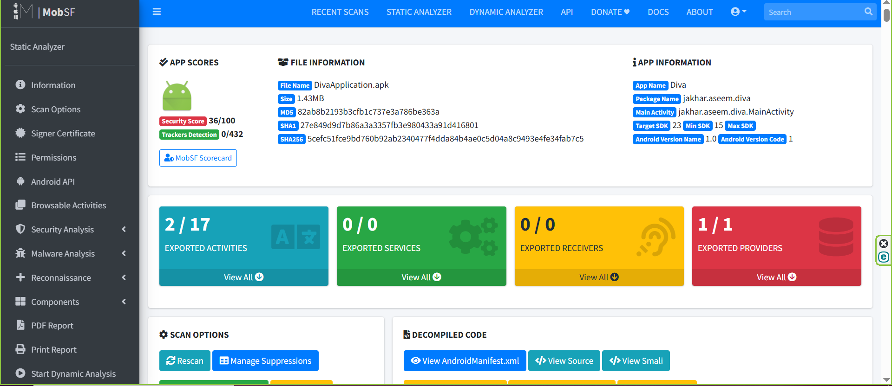

---

### 4.2 Lancement de l'analyse dynamique

Depuis le rapport statique, j'ai cliqué sur **Start Dynamic Analyzer**. MobSF a alors exécuté automatiquement la séquence suivante sur l'émulateur :

1. Installation de l'APK DIVA via ADB
2. Démarrage de **Frida Server** sur le device (en tant que root)
3. Installation du **certificat CA MobSF** dans le trust store système — permettant le déchiffrement du trafic TLS sans erreur côté application
4. Configuration du **proxy HTTP/HTTPS global** sur l'émulateur (redirection vers `127.0.0.1:1337`)

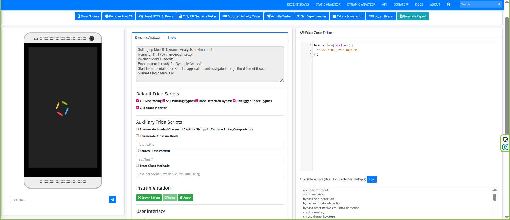

Les **Default Frida Scripts** activés automatiquement sont :

| Script | Rôle |
|---|---|
| API Monitoring | Hooke les API Android sensibles (crypto, file, network) |
| SSL Pinning Bypass | Contourne le certificate pinning implémenté dans l'app |
| Root Detection Bypass | Bypasse les checks de détection root |
| Debugger Check Bypass | Désactive les anti-debug mécanismes |
| Clipboard Monitor | Capture le contenu du presse-papier |

---

## 5. Tests de sécurité dynamiques

### 5.1 Insecure Logging — CWE-532

**Description de la vulnérabilité :** L'application écrit des données sensibles (identifiants, tokens, données utilisateur) dans les logs Android (`android.util.Log`). Ces logs sont accessibles à toute application disposant de la permission `READ_LOGS`, ou directement via ADB par un attaquant ayant accès physique ou USB au device.

**Test réalisé :** J'ai ouvert le challenge **"1. Insecure Logging"** dans DIVA et saisi la valeur `12356` dans le champ de saisie, puis cliqué sur **CHECK OUT**. Le **Logcat Stream** de MobSF, filtré sur le package `jakhar.aseem.diva`, a capturé en temps réel les logs émis par l'activité `LogActivity`.

Les logs montrent que l'application écrit les entrées utilisateur directement dans le flux logcat sans aucune sanitisation ni obfuscation.

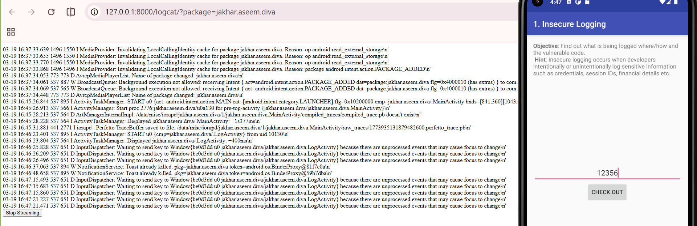

**Référence OWASP Mobile :** M9 — Insecure Data Storage / M1 — Improper Credential Usage

---

### 5.2 TLS/SSL Security Testing — CWE-295

**Description de la vulnérabilité :** L'absence de certificate pinning et la mauvaise configuration TLS permettent à un attaquant en position MITM d'intercepter et déchiffrer le trafic HTTPS d'une application, même si celui-ci est chiffré côté transport.

**Test réalisé :** J'ai lancé le **TLS/SSL Security Tester** de MobSF qui exécute automatiquement trois tests successifs sur l'application :

| Test | Description | Résultat |
|---|---|---|
| TLS Misconfiguration Test | Vérifie si l'app accepte des connexions HTTPS avec des certificats non fiables | ✅ Vulnérable |
| TLS Pinning / Certificate Transparency Test | Vérifie si l'app implémente du certificate pinning ou la Certificate Transparency | ✅ Absent |
| TLS Pinning Bypass Test | Tente de bypasser le pinning via Frida | ✅ Bypassed |
| Cleartext Traffic Test | Détecte si l'app autorise le trafic HTTP en clair | ✅ Autorisé |

DIVA ne dispose d'aucun mécanisme de protection TLS. MobSF a pu intercepter l'intégralité du trafic applicatif grâce à son certificat CA installé dans le trust store système de l'émulateur.

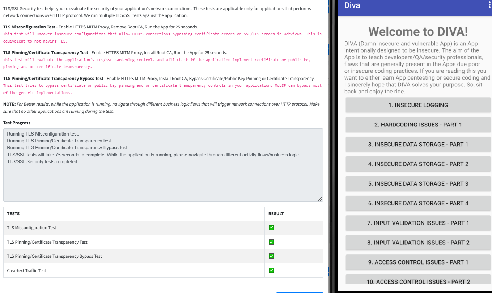

**Référence OWASP Mobile :** M5 — Insecure Communication

---

### 5.3 Exported Activities — Access Control (CWE-926)

**Description de la vulnérabilité :** Une activité Android marquée `exported="true"` dans le `AndroidManifest.xml` sans permission de protection peut être déclenchée par n'importe quelle application tierce via un intent explicite, sans authentification préalable. Cela constitue une faille de contrôle d'accès permettant à une app malveillante d'accéder directement à des écrans sensibles.

**Test réalisé :** J'ai utilisé l'**Exported Activity Tester** de MobSF qui énumère automatiquement toutes les activités exportées et les lance successivement sur l'émulateur.

L'activité `jakhar.aseem.diva.APICredsActivity` s'est ouverte directement sur l'émulateur sans aucune interaction utilisateur préalable et sans authentification — démontrant qu'elle est accessible via intent depuis n'importe quelle application.

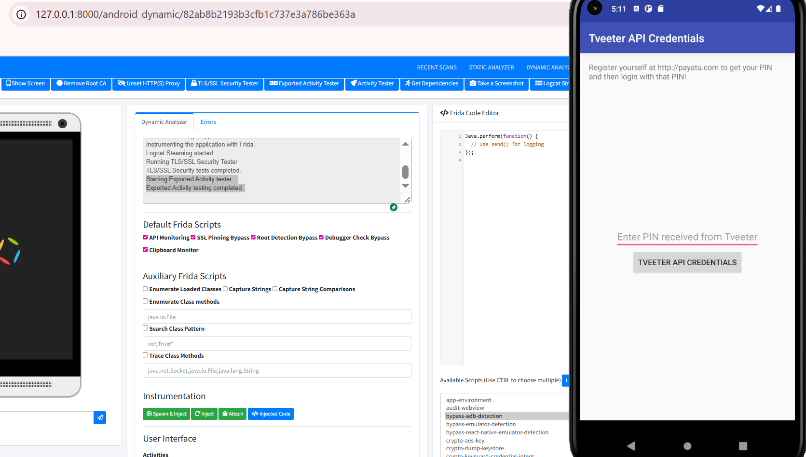

Le rapport dynamique MobSF confirme la liste des activités exportées avec leurs screenshots capturés automatiquement :


**Référence OWASP Mobile :** M1 — Improper Credential Usage / M3 — Insecure Authentication

---

### 5.4 Hardcoded Credentials — CWE-798

**Description de la vulnérabilité :** Des secrets (clés API, mots de passe, tokens) codés en dur dans le code source ou les ressources d'une application sont facilement extractibles par décompilation statique ou observation dynamique. Cette pratique expose directement les systèmes backend auxquels ces credentials donnent accès.

**Observation :** Via l'Activity Tester, l'activité **"Vendor API Credentials"** a affiché en clair les secrets suivants directement à l'écran :

```
API Key:       123secretapikey123
API User name: diva
API Password:  p@ssword
```

Ces valeurs sont stockées en dur dans le code Java de l'application et ne font l'objet d'aucun chiffrement ni obfuscation. Une décompilation avec `jadx` ou une analyse Frida suffisent à les extraire en quelques secondes.

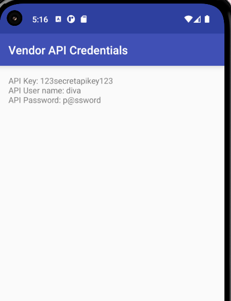

**Référence OWASP Mobile :** M1 — Improper Credential Usage

---

### 5.5 Input Validation Issues — CWE-20

**Description de la vulnérabilité :** L'absence de validation des entrées utilisateur dans les composants natifs d'une application Android peut mener à des corruptions mémoire, des buffer overflows, voire de l'exécution de code arbitraire dans les cas les plus critiques.

**Test réalisé :** J'ai utilisé l'**Activity Tester** pour lancer directement le challenge **"13. Input Validation Issues - Part 3"**. Ce challenge simule un système de lancement de missiles (WOMD) dont l'objectif est de crasher l'application en soumettant une entrée non validée — illustrant les risques d'un composant natif sans boundary checks.

Le Dynamic Analyzer affichait la séquence des tests effectués : Exported Activity testing, Activity testing, et collecte des dépendances.

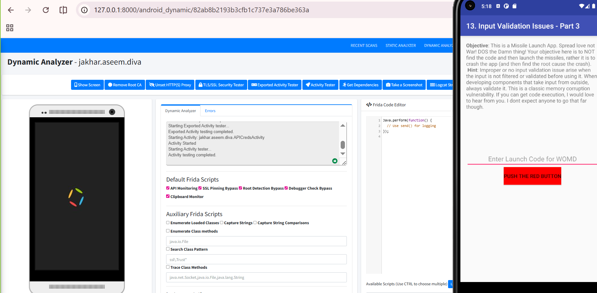

**Référence OWASP Mobile :** M7 — Insufficient Binary Protections

---

### 5.6 Runtime Dependencies

J'ai utilisé **Get Dependencies** pour collecter les dépendances runtime de DIVA. MobSF interroge l'application en cours d'exécution pour identifier les librairies chargées dynamiquement, les composants natifs (.so), et les dépendances tierces — informations utiles pour évaluer la surface d'attaque étendue de l'application.

Le log a confirmé : `Getting application runtime dependencies` → `Dependencies collected!`

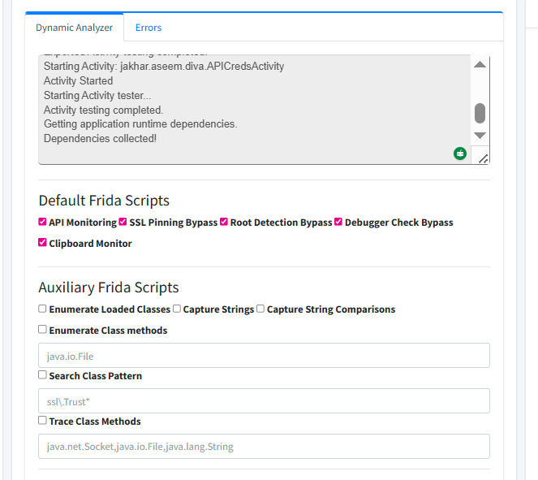

---

### 5.7 Instrumentation Frida

Frida est un framework d'instrumentation dynamique permettant d'injecter du JavaScript dans un processus en cours d'exécution pour hooker des méthodes, lire la mémoire, modifier le comportement de l'application à la volée — sans modifier l'APK.

#### Spawn & Inject

J'ai cliqué sur **Spawn & Inject** pour injecter Frida dans le processus `jakhar.aseem.diva`. MobSF a confirmé `Instrumenting the application with Frida`. Le bouton **Injected Code** est apparu, permettant de consulter le script complet injecté dans le processus.

#### Script `crypto-aes-key`

J'ai chargé le script **`crypto-aes-key`** depuis la bibliothèque de scripts disponibles. Ce script hooke les implémentations Java de `SecretKeySpec` et `KeyGenerator` pour intercepter les clés AES au moment de leur instanciation, avant tout chiffrement. La ligne clé du script :

```javascript
send("Creating " + alg + " secret key, plaintext:\n" + hexdump(key));
```

Cela permet d'extraire dynamiquement toute clé cryptographique utilisée par l'application, y compris celles générées à partir de dérivations complexes (PBKDF2, etc.) — sans avoir besoin d'analyser l'algorithme de dérivation.

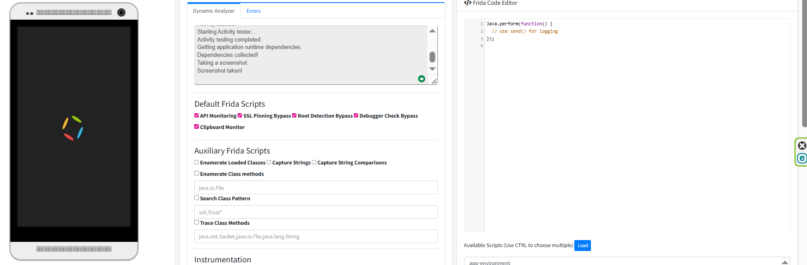

#### Script `bypass-emulator-detection`

J'ai chargé le script **`bypass-emulator-detection`** pour contourner les mécanismes anti-émulateur. Ces mécanismes vérifient typiquement des propriétés système caractéristiques d'un émulateur : `ro.build.fingerprint`, IMEI, numéro de téléphone, présence de fichiers spécifiques, etc. Le script bypasse chacun de ces checks via des hooks Frida.

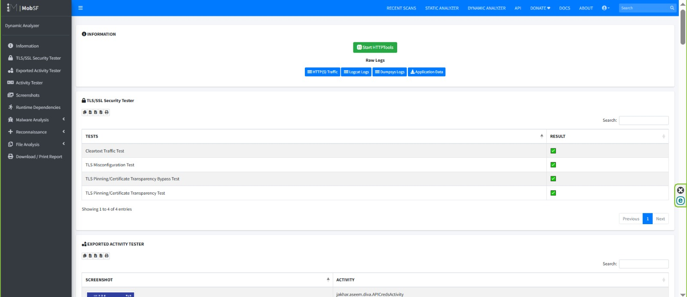

#### Injected Code

Le bouton **Injected Code** affiche le script Frida complet injecté dans le processus, incluant le bridge Java/Frida (`Java.perform`) et l'ensemble des hooks définis pour l'instrumentation runtime.


---

## 6. Synthèse des vulnérabilités

| # | Vulnérabilité | CWE | OWASP Mobile | Criticité | Observation |
|---|---|---|---|---|---|
| 1 | Insecure Logging | CWE-532 | M9 | Moyenne | Données utilisateur écrites en clair dans logcat |
| 2 | Absence de Certificate Pinning | CWE-295 | M5 | Haute | Trafic TLS entièrement interceptable via MITM |
| 3 | Cleartext Traffic autorisé | CWE-319 | M5 | Haute | HTTP non chiffré autorisé dans le manifest |
| 4 | Exported Activity non protégée | CWE-926 | M3 | Haute | `APICredsActivity` accessible sans permission |
| 5 | Hardcoded Credentials | CWE-798 | M1 | Critique | API Key + password en dur dans le code |
| 6 | Absence de validation des entrées | CWE-20 | M7 | Haute | Composant natif exposé sans boundary checks |
| 7 | Exported Content Provider | CWE-926 | M3 | Moyenne | 1/1 provider exposé sans permission déclarée |

**Score de sécurité MobSF : 36/100**

---

## 7. Rapport MobSF

MobSF génère un rapport dynamique complet accessible via **Generate Report** (ou via le menu latéral **Download / Print Report**). Ce rapport consolide l'ensemble des observations collectées pendant la session d'analyse :

- Résultats des tests TLS/SSL
- Liste des activités exportées avec screenshots automatiques
- Logs applicatifs capturés
- Données réseau interceptées
- Résultats Frida


---

## 8. Conclusion

Ce lab m'a permis de mettre en œuvre une chaîne d'analyse dynamique complète sur une application Android, en combinant plusieurs techniques complémentaires :

- **Instrumentation Frida** pour le hooking de méthodes à l'exécution et l'interception de clés cryptographiques
- **Proxy MITM** avec certificat CA installé pour le déchiffrement du trafic TLS
- **Enumération des composants exportés** pour l'identification de failles de contrôle d'accès
- **Analyse des logs runtime** pour la détection de fuites d'informations sensibles

L'application DIVA illustre de manière didactique les erreurs de développement les plus fréquentes en contexte mobile. Dans un scénario réel, les vulnérabilités identifiées — notamment les hardcoded credentials (CWE-798) et les exported activities non protégées (CWE-926) — permettraient à un attaquant d'accéder à des ressources backend ou de compromettre les données utilisateur sans nécessiter de privilèges élevés sur le device.

MobSF, couplé à Frida, constitue un environnement d'analyse puissant qui automatise une grande partie du workflow de pentest mobile tout en offrant la flexibilité nécessaire pour des tests avancés et sur mesure.
